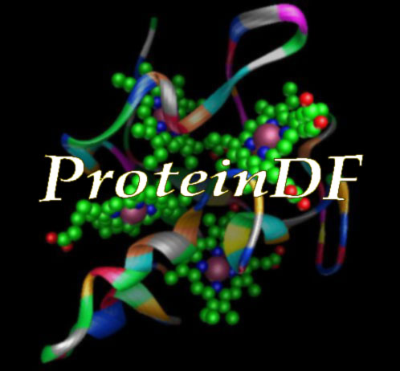



[English](./index.html)
[Japanese](./index_j.html)

## Abount
ProteinDF はオープンソースの量子化学計算ソフトウェアパッケージです。

## News
<ul class="posts">
  
    <li>{{ post.date | date_to_string }} &raquo; <a href="{{ BASE_PATH }}{{ post.url }}">{{ post.title }}</a></li>  
</ul>

## GitHub Repository

### ProteinDF
[https://github.com/ProteinDF/ProteinDF](https://github.com/ProteinDF/ProteinDF)

### ProteinDF_bridge
[https://github.com/ProteinDF/ProteinDF_bridge](https://github.com/ProteinDF/ProteinDF_bridge)

### ProteinDF_pytools
[https://github.com/ProteinDF/ProteinDF_pytools](https://github.com/ProteinDF/ProteinDF_pytools)

### QCLObot
[https://github.com/ProteinDF/QCLObot](https://github.com/ProteinDF/QCLObot)

## manual

[ProteinDF user manual](http://proteindf.github.io/ProteinDF_userman/ja/index.html)
[QCLObot user manual](http://proteindf.github.io/QCLObot/)

## Cite

### ProteinDF
* F. Sato, Y. Shigemitsu, I. Okazaki, S. Yahiro, M. Fukue, S. Kozuru, H. Kashiwagi, “Development of a new density functional program for all-electron calculation of proteins”, Int. J. Quant. Chem., 63, 245-246 (1997).
* I. Okazaki, F. Sato, T. Yoshihiro, T. Ueno, H. Kashiwagi, "Development of a restricted open shell Kohn–Sham program and its application to a model heme complex", THEOCHEM, 451, 109-119 (1998).
* T. Yoshihiro, F. Sato, H. Kashiwagi, "Distributed parallel processing by using the object-oriented technology in ProteinDF program for all-electron calculations on proteins", Chem. Phys. Lett., 346, 313–321 (2001).
* T. Inaba, F. Sato, "Development of parallel density functional program using distributed matrix to calculate all-electron canonical wavefunction of large molecules", J. Comput. Chem., 28, 984–995 (2007).
* T. Hirano, F. Sato, "A third-generation density-functional-theory-based method for calculating canonical molecular orbitals of large molecules", PCCP, 16, 14496-14503 (2014).

### QCLO
* H. Kashiwagi, H. Iwai, K. Tokieda, M. Era, T. Sumita, T. Yoshihiro, F. Sato, "Convergence process with quasi-canonical localized orbital in all-electron SCF calculation on proteins", Mol. Phys., 101, 81-86 (2003).
* N. Nishino-Uemura, T. Hirano, F. Sato, "Study of the quasicanonical localized orbital method based on protein structures", J. Chem. Phys., 127, 184106 (2007).

## References using the ProteinDF
* T. Inaba, S. Tahara, N. Nisikawa, H. Kashiwagi, F. Sato, "All-electron density functional calculation on insulin with quasi-canonical localized orbitals.", J. Comput. Chem., 26, 987-93 (2005).
* T. Inaba, N. Tsunekawa, T. Hirano, T. Yoshihiro, H, Kashiwagi, F. Sato, "Density functional calculation of the electronic structure on insulin hexamer", Chem. Phys. Lett., 434, 331-335 (2007).
* K. Chiba, T. Hirano, F. Sato, M. Okamoto, "A Density Functional Study on Reaction Center Models of Horse Heart Carbonmonoxy Myoglobin –Effect of Distal Histidine to the Electronic States–", J. Comput. Chem., Jpn, 7, 165-170 (2008).
* Y. Tokita, J. Shimura, H. Nakajima, "Mechanism of Intramolecular Electron Transfer in the Photoexcited Zn-Substituted Cytochrome c: Theoretical and Experimental Perspective", J. Am. Chem. Soc., 130, 5302–5310 (2008).
* Y. Tokita, S. Yamada, W. Luo, Y. Goto, N. Bouley-Ford, H. Nakajima, Y. Watanabe, "Protein photoconductors and photodiodes", Angew. Chem., 50, 11663-6 (2011)
* K. Chiba, T. Hirano, F. Sato, M. Okamoto, "Clarification of the role of protein in carbonmonoxy myoglobin by investigating electronic states", Int. J. Quant. Chem.,113, 2345-2354, 2013).

If you know the other unlisted articles using the ProteinDF, please let me know.

## License
ProteinDFはGNU GPL v3に基づいて配布されます。
ソースコードはGithubから取得できます。

## バグ・要望
バグを発見された場合はご連絡ください。
また機能追加などのご要望もお知らせ下さい。
